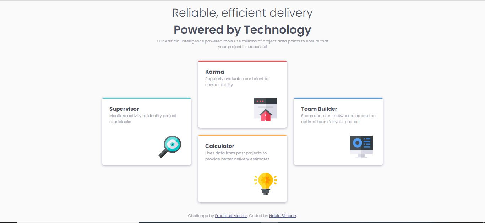

# Frontend Mentor - Four card feature section solution

This is a solution to the [Four card feature section challenge on Frontend Mentor](https://www.frontendmentor.io/challenges/four-card-feature-section-weK1eFYK). Frontend Mentor challenges help you improve your coding skills by building realistic projects. 

## Table of contents

- [Overview](#overview)
  - [The challenge](#the-challenge)
  - [Screenshot](#screenshot)
  - [Links](#links)
- [My process](#my-process)
  - [Built with](#built-with)
  - [What I learned](#what-i-learned)
  - [Continued development](#continued-development)
  - [Useful resources](#useful-resources)
- [Author](#author)

## Overview

### The challenge

Users should be able to:

- View the optimal layout for the site depending on their device's screen size

### Screenshot



### Links

- Solution URL: [Add solution URL here](https://your-solution-url.com)
- Live Site URL: [Add live site URL here](https://your-live-site-url.com)

## My process

### Built with

- Semantic HTML5 markup
- CSS custom properties
- Flexbox
- CSS Grid
- Destop-first workflow


### What I learned

I wonder how I will do this if I hadn't understand grid. The moment I understood grid, I embarked on the project which I didn't regret. I used this project to practice my grid layouts.

```html

```
```css
    .grid-container {
        grid-template-columns: repeat(3, 250px);
        grid-template-areas: 
        ".three."
        "one three two"
        "one four two"
        ".four.";
    }
```
```js

```

### Continued development

Well, I want to move animation and transition

### Useful resources

- [Learn grid the easy way](https://www.youtube.com/watch?v=rg7Fvvl3taU) - This helped because it helped understand grid better. I'd recommend it to anyone still learning this concept.


## Author

- Website - [Ojelabi Simeon](https://github.com/NobleSimeon)
- Frontend Mentor - [@yourusername](https://www.frontendmentor.io/profile/NobleSimeon)
- Twitter - [@yourusername](https://www.twitter.com/SimeonPelumi)

